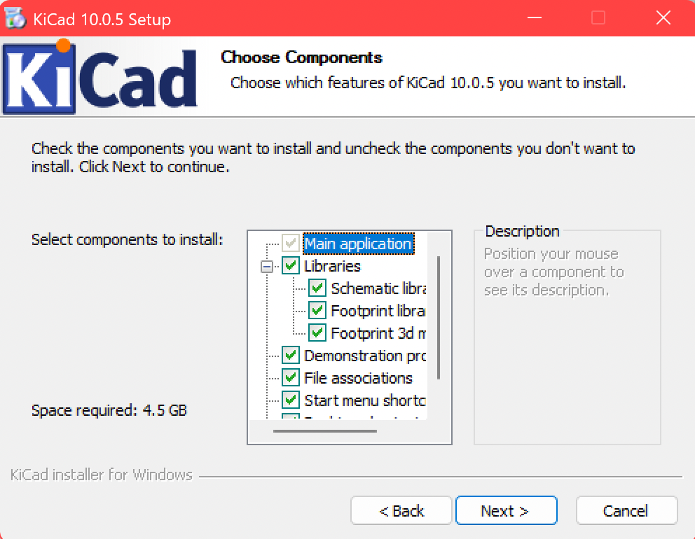
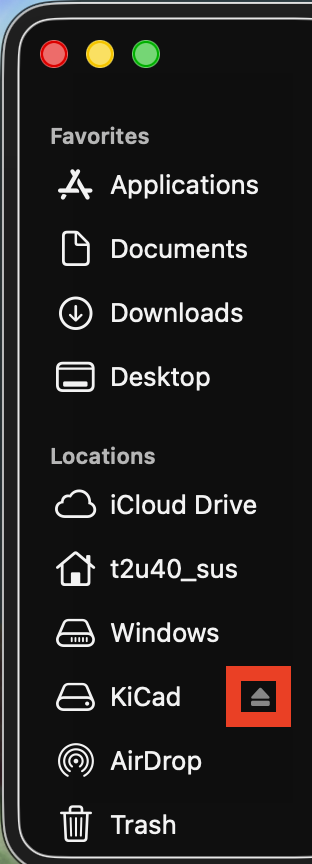
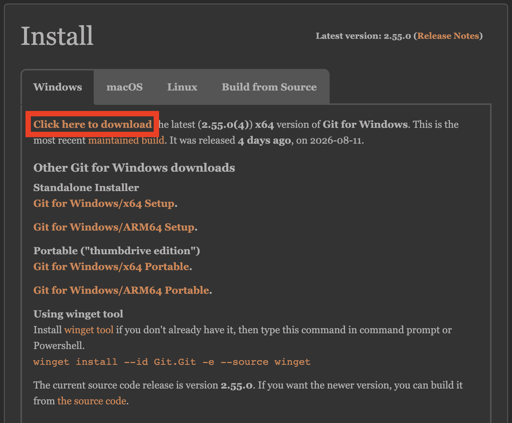
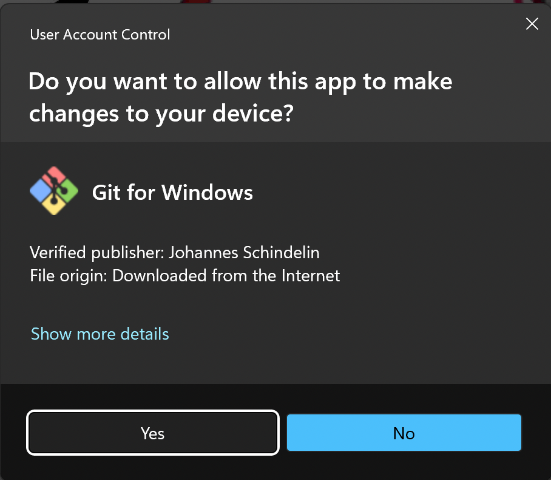
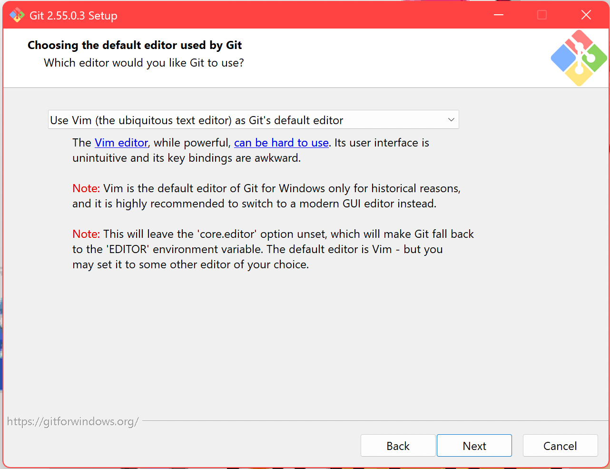
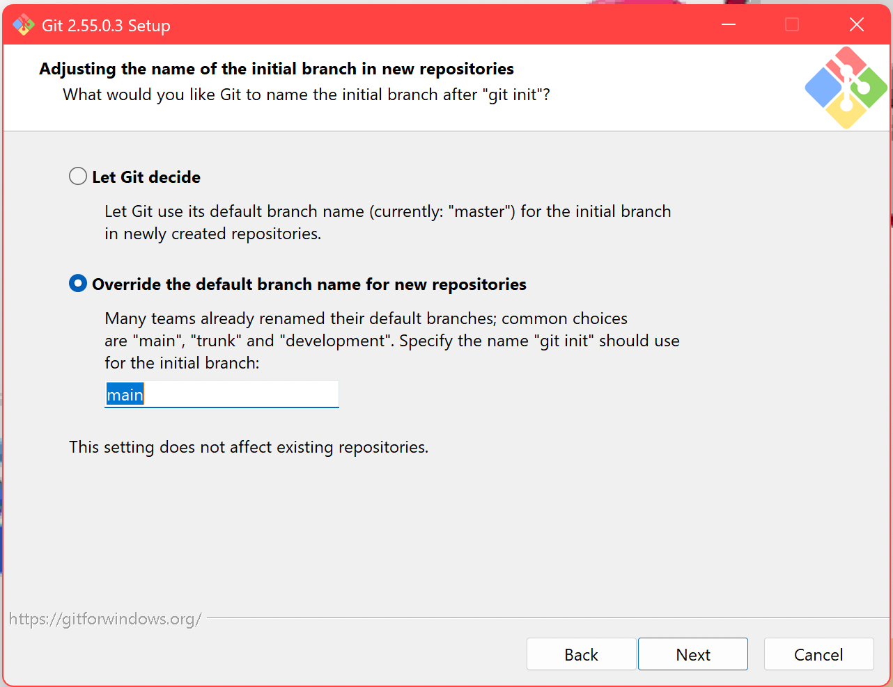
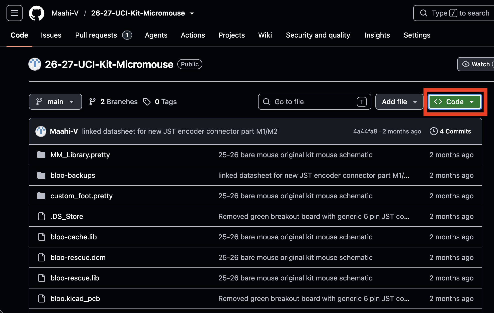
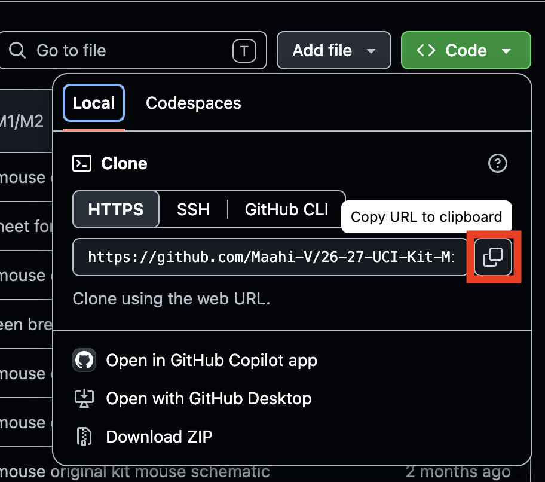

# UCI Kit Mouse (2026-2027 Ver.)

This repository contains:
 - A template kit mouse project with KiCad
 - Short installation guide for the overall project
 - Helpful Git Commands

> [!IMPORTANT]
> Contents here are summarized from [IEEE@UCI Micromouse Website](https://ieee.ics.uci.edu/micromouse/mm_index.html).
> More details of the tools installed will be under "Modules" and "Lectures."

## Prerequistes


### KiCad
> [!NOTE]
> All teamates should install the same version of KiCad, preferably the newest
> stable release here: https://www.kicad.org/download/. 
> Files modified from newer versions can no longer be read by older versions.

*The installation guide will be using KiCad ver. 10.5*

<details>
<summary><b>Windows</b></summary>

1. Select **Next** 2 times, and give permissions to the installer.

2. At "Choose Components," make sure all check boxes are selected 
(should be default)


3. Select **Next**, and then install.
</details>

<details>
<summary><b>macOS</b></summary>

1. Double-click `kicad-unified-universal-#.#.#.dmg` file in finder

2. Click and drag the `KiCad.app` to Application folder.


3. Close the window, and Eject the `.dmg` file from Finder.


</details>

<details>
<summary><b>Linux</b></summary>
Install as an AppImage or use your desired package manager. <br></br>

> [!NOTE]
> KiCad does not support Wayland,
> but the AppImage version defaults to Wayland instead of 
> Xwayland under GTK3. Installing via PPAs instead defaults to Xwayland, 
> likely bringing graphical bugs.

</details>

---
### Git
Check if Git is installed with this command:
```sh
git --version
```

If git is missing, here are official steps in 
[installing Git](https://git-scm.com/install/), and
a recommended step-by-step installation will be provided below.


<details>
<summary><b>Windows</b></summary>

1. Install **Git for Windows** from this link: [https://git-scm.com/install/windows](https://git-scm.com/install/windows).


2. After installing the executable, give the installer permissions.


3. Select **Next** 4 times, and reach "Choosing the default editor used by Git"

Choose your favorite editor, and after setup you can still change the 
default editor with this command:
```sh
git config --global core.editor "editor-name"
```

4. Select **Next** to "Adjusting the name of the initial branch in 
new repositories"
- Use default branch name as `main`, since GitHub defaults to `main` as well.



5. Keep selecting **Next** and finish installing.


</details>

<details>
<summary><b>macOS</b></summary>

Install **Xcode Command Line Tools** from Apple for `git` and other tools:
```sh
xcode-select --install
```
... and more info about what is downloaded is [here](https://developer.apple.com/documentation/xcode/installing-the-command-line-tools/).


If you prefer installing ONLY `git` with `homebrew`, here is the command:
```sh
brew install git
```
</details>

<details>
<summary><b>Linux</b></summary>

Install `git` with package manager or build from source, 
as seen from this site: [https://git-scm.com/install/linux](https://git-scm.com/install/linux).
</details>


#### Setting up SSH Keys

After installing git, you need to configure a few things before being
able to edit your remote repositories on GitHub.


#### Other Git Tools
For a GUI experience, try out these software:
 - [GitHub Desktop](https://docs.github.com/en/desktop/overview/about-github-desktop).
 - Connecting GitHub to VS Code, and utilizing [Source Control](https://code.visualstudio.com/docs/sourcecontrol/overview)


## Cloning this Repository

<details>
<summary><b>On Terminal</b></summary>

Source: [https://docs.github.com/en/repositories/creating-and-managing-repositories/cloning-a-repository](https://docs.github.com/en/repositories/creating-and-managing-repositories/cloning-a-repository).

Click the green button labled **<> Code**



Copy the clone link as HTTPS



Open your terminal, change directory to somewhere you want to put your 
local repository in.

Type `git clone `, then paste and run the command:
```sh
$ git clone https://github.com/Maahi-V/26-27-UCI-Kit-Micromouse.git
>   Cloning into '26-27-UCI-Kit-Micromouse'...
>   remote: Enumerating objects: 135, done.
>   remote: Counting objects: 100% (135/135), done.
>   remote: Compressing objects: 100% (78/78), done.
>   remote: Total 135 (delta 69), reused 118 (delta 52), pack-reused 0 (from 0)
>   Receiving objects: 100% (135/135), 3.28 MiB | 12.25 MiB/s, done.
>   Resolving deltas: 100% (69/69), done.
```
</details>

<details>
<summary><b>GitHub Desktop</b></summary>

Source: [https://docs.github.com/en/desktop/adding-and-cloning-repositories/cloning-a-repository-from-github-to-github-desktop](https://docs.github.com/en/desktop/adding-and-cloning-repositories/cloning-a-repository-from-github-to-github-desktop).
</details>


## Turning local repository into a GitHub remote repository


## Helpful Git Commands

For more details, use the `man git` command or use the official
documentation: [https://git-scm.com/docs](https://git-scm.com/docs).
```sh
git status

git log

git reflog

git fetch

git pull

git add

git diff

git push

git rebase

git branch

git switch

git checkout
```

## How to Submit on Canvas/Gradescope

